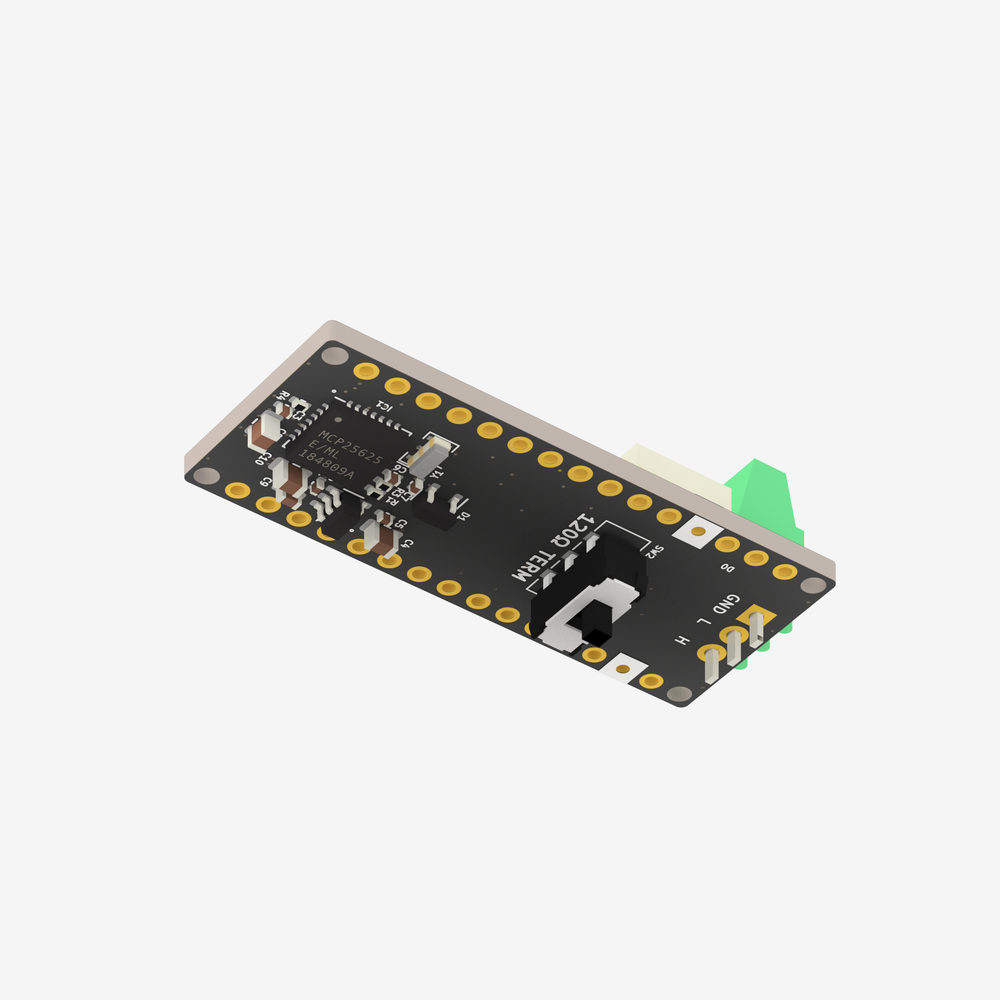
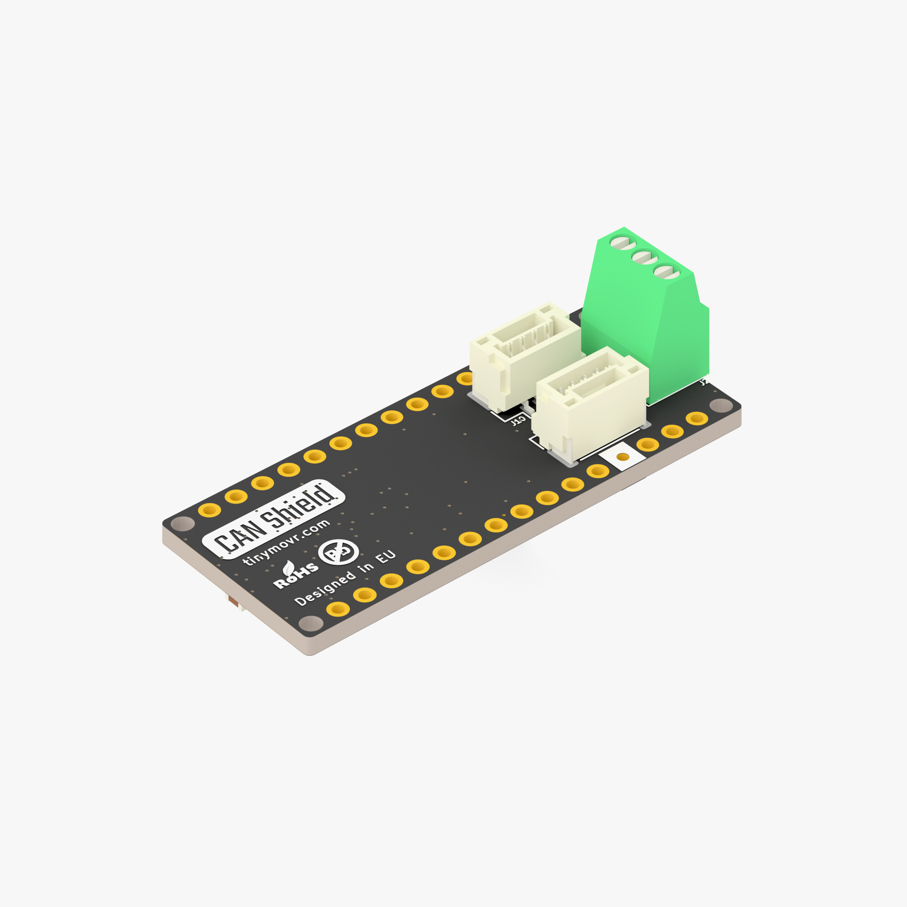

# Tinymovr Arduino Nano CAN Bus Shield

This is the official repository for the [Tinymovr Arduino Nano CAN Bus Shield](https://tinymovr.com/products/arduino).

The included example sketch provides a diagnostic loopback test for the shield. This helps verify that your CAN hardware is functioning correctly before connecting to a real CAN network.




## Features

- Hardware initialization and power management for MCP25625-based shields
- Loopback mode for self-testing without external CAN devices
- Detailed serial output for debugging
- Sends and receives test messages to verify full CAN stack operation

## Hardware Requirements

- Arduino Nano (or compatible board)
- [Tinymovr Arduino Nano CAN Bus Shield](https://tinymovr.com/products/arduino)
  - MCP25625 CAN controller with integrated transceiver
  - 16MHz crystal oscillator
  - AP3602 5V boost regulator
  - Standard SPI connection

## 3D Model

A STEP file ([nano-shield.step](nano-shield.step)) is included in this repository for mechanical design and enclosure integration.

## Pin Configuration

| Pin | Function | Description |
|-----|----------|-------------|
| 10  | CS       | SPI Chip Select |
| 2   | INT      | Interrupt pin |
| 5   | RST      | Hardware reset (active low) |
| 9   | STBY     | Standby control (LOW = normal operation) |
| 8   | 5V_SHDN  | 5V boost regulator shutdown (HIGH = enabled) |

## Dependencies

This sketch requires the **autowp-mcp2515** library:

```bash
# Install via Arduino Library Manager
# Search for: "autowp-mcp2515"
```

Or install manually from: https://github.com/autowp/arduino-mcp2515

## Configuration

### CAN Bitrate

The CAN bitrate can be configured at the top of the sketch ([CANBusLoopback.ino:15](CANBusLoopback.ino#L15)):

```cpp
const CAN_SPEED CAN_BITRATE = CAN_500KBPS;  // Change this to match your CAN network
```

**Supported bitrates:**
- `CAN_5KBPS` - 5 kbps
- `CAN_10KBPS` - 10 kbps
- `CAN_20KBPS` - 20 kbps
- `CAN_31K25BPS` - 31.25 kbps
- `CAN_33KBPS` - 33 kbps
- `CAN_40KBPS` - 40 kbps
- `CAN_50KBPS` - 50 kbps
- `CAN_80KBPS` - 80 kbps
- `CAN_100KBPS` - 100 kbps
- `CAN_125KBPS` - 125 kbps (common in automotive)
- `CAN_200KBPS` - 200 kbps
- `CAN_250KBPS` - 250 kbps (common in industrial)
- `CAN_500KBPS` - 500 kbps (default, common in automotive)
- `CAN_1000KBPS` - 1000 kbps (1 Mbps)

**Important:** The bitrate must match all other devices on your CAN network. Using different bitrates will prevent communication.

## Usage

### Testing in Loopback Mode (Default)

1. Upload the sketch to your Arduino
2. Open Serial Monitor at 115200 baud
3. Observe the initialization sequence and test messages
4. You should see messages being sent and received successfully

Expected output:
```
Starting CAN Shield Test...
[1/4] Configuring pins...
[2/4] Resetting MCP25625...
[3/4] Initializing CAN controller...
[4/4] Setting CAN mode...
Setup Complete! Starting test loop...

Loop #1
  -> Sending message (ID: 0x123)... OK
  <- Checking for messages... Received!
     ID: 0x123 | Data (4 bytes): DE AD BE EF
```

### Connecting to a Real CAN Network

1. **Configure the bitrate** to match your CAN network (see [Configuration](#configuration) section above)
2. Connect your CAN shield to a CAN bus (CANH and CANL)
3. Ensure proper termination resistors (120Ω) on the bus
4. In the code, comment out the loopback mode line and uncomment normal mode:
   ```cpp
   // mcp.setLoopbackMode();  // Comment this out
   mcp.setNormalMode();       // Uncomment this line
   ```
5. Upload and monitor for real CAN traffic

## Troubleshooting

### "ERROR: Failed to set bitrate!"

- Check SPI wiring (MOSI, MISO, SCK, CS)
- Verify CS pin is set correctly (default: pin 10)
- Ensure MCP2515/MCP25625 is properly powered
- Confirm 16MHz crystal oscillator is present

### No Messages Received in Loopback Mode

- Check that loopback mode is enabled
- Verify the MCP2515 initialized successfully
- Try increasing the delay between send and receive

### No Messages Received on Real CAN Network

- **Verify bitrate matches** - All devices must use the same bitrate
- Check CANH and CANL connections
- Ensure proper bus termination (120Ω resistors at both ends)
- Confirm you've switched to normal mode (not loopback)
- Check that other devices are actively transmitting

### Hardware Not Responding

- Verify 5V boost regulator is enabled (PIN_5V_SHDN = HIGH)
- Check that standby mode is disabled (PIN_CAN_STBY = LOW)
- Try the hardware reset sequence again

## License

This project is licensed under the Apache License 2.0 - see the [LICENSE](LICENSE) file for details.

## Contributing

Contributions are welcome! Please feel free to submit issues or pull requests.
